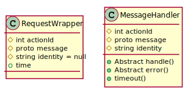

<style>
body {
	direction:rtl
}
code.pre{
	direction:ltr !important
}
</style>
هر آنچه در این فصل آورده شده، الگوریتم های پیشنهادی ما برای پیاده سازی کلاینت است و پیشنهاد ما به شما مطالعه این بخش است.


توضیحات:
درخواست های کلاینت و پاسخ های سرور روی بسته web socket جابجا میشوند. برای رفع مشکلات ارتباط با سرور پیشنهاد میشود کلاینت را به صورت زیر پیاده سازی کنید. مفاهیم ما به شرح زیر است:


RequestWrapper:
Objectی که کل اطلاعات درخواست را ذخیره میکند، برای هر درخواست به سرور باید یکی ازاین objectها ساخته شود و به تابع sendRequest داده شود. وظیفه تابع sendRequest اینست که کل عملیاتی که برای انتقال درخواست به سرور لازم است را انجام دهد.

MessageHandler:
کلاس والد که وظیفه پردازش داده های ارسالی از سمت سرور و همچنین تعیین تکلیف داده های بدون جواب است.
3 تابع اصلی به نام های ```handle()``` , ```error()``` , ```timeout()``` هستند. بعد پیاده سازی کامل این الگوریتم روش استفاده به شرح زیر است:
برای هر متدی که در بخش iGapDoc  لیست شدند یک کلاس می سازیم که از MessageHandler مشتق شده است. با ارسال هر درخواست 3حالت به وجود میاید:

1.	سرور پاسخ موفقیت آمیز میدهد و سپس متد ```handle()``` اجرا میشود.
2.	سرور پاسخ خطا برمیگرداند و سپس متد ```error()``` اجرا خواهد شد.
3.	سرور پاسخی برنمیگرداند و سپس متد ```timeout()``` اجرا میشود.

با توجه به نیاز درخواست ها را به سه حالت تقسیم بندی کردیم:

1.	تکی: که به صورت مستقل پردازش میشوند.
2.	گروهی: پردازش اینها به صورت وابسته هم است. درصورتی که تمام اعضای گروه پیام موفقیت آمیز از سرور بگیرند، متد handle() تمامی آنها باهم اجرا میشود. سپس تمامی درخواست ها منتظر می مانند تا پاسخ تمامی آنها ارسال شود. درصورتی که حتی یکی از اعضای گروه با پیام error  یا  timeout برخورد کند، به ترتیب ```error()``` و ```timeout()``` همه اعضای گروه فراخوانی میشود.
3.	همبسته: برخی درخواست های تکی در طول زمان باهم ارتباط دارند. مثلا آپلود فایل با حجم یک مگابایت شامل چهار درخواست می شود که این 4تا باهم ارتباط تنگاتنگ دارند. برای ارتباط دادن این 4تا از مشخصه identity استفاده میکنیم تا درخواست های تکی همبسته شوند، یعنی identity همه 4 درخواست یکسان قرار داده میشوند تا برای مثال آپلود همزمان دو فایل باهم تداخل نداشته باشند.


##پیش نیاز ها:
```function PollRequestQueue()```
بررسی کل درخواست هایی که وضعیت نامشخص دارند.و بعد از TIMEOUT-MS متد ```timeout()``` را فراخوانی میکند. 

```Global SymmetricKey``` 
کلیدی برای رمزنگاری داده ها بین کلاینت و سرور

```Global SymmetricIvSize```
سایز IV برای تبادل اطلاعات بین کلاینت و سرور

```Global SymmetricMethod```
نوع cipher را مشخص میکند.

```Global PollRequestQueueRunned = false```
مشخص میکند که تابع PollRequestQueue() اجرا شده یا نه. 

```Global unSecureMethods = array(2)``` 
درخواست که به صورت غیر امن حق ارسال به سرور را دارند.

```Config TIMEOUT-DELAY-MS = 1000```
تابع PollRequestQueue() با چه تاخیری اجرا می شود.

```Config TIMEOUT-MS = 10000```
متد timeout() را فراخوانی میکند.



#توابع

```php
function SendRequest(RequestWrapper requestWrapper){
	if(RequestWrapper == 0)
	Exception;
	RequestRandomId = random(az-AZ0-9);
    if(RequestWrapper == 1){
        PrepareRequest(RequestRandomId,RequestWrapper[0]);
    }else{
	RequestRandom =[];
    for(i=0 ; i < RequestWrapper.count ; i++)
    	RequestRandom [] = null;
    RequestQueueRelation[RequestRandomId] = RequestRandom;
    foreach(RequestWrapper){
    	PrepareRequest(RequestRandomId + "." + index,RequestWraper[index]);
    }
	}
}
```

```
RequestQueue = 
[
	RequestRandomId   => RequestWrapper
    RequestRandomId.0 => RequestWrapper
    RequestRandomId.1 => RequestWrapper
    RequestRandomId.2 => RequestWrapper
    .
    .
]
```


```php
RequestQueueRelation = 
[
	RequestRandomId = [(null | MessageHandler MessageHandler),...]
]
```
<p style="direction:rtl">
که خود شامل یک آرایه است که مقادیر آن بسته به تعداد اعضای گروه، یا نال است یا یک آبجکتی از MessageHandler

</p>


<p style="direction:rtl">
  این تابع دو پارامتر به نام های RequestRandomId  و  RequestWrapper میگیرد و چیزی برنمیگرداند.اگر مقدار PollRequestQueueRunned برابر false بود، به اندازه مقدار TIMEOUT-DELAY-MS یک تاخیر اتفاق میفتد  و سپس تابع PollRequestQueue اجرا میشود. زمان فعلی برای RequestWrapper درج میشود وسپس یک prot  ساخته می شود. بعدازاین یک شی از نوع Request میسازیم و شناسه آن را برابر RequestRandomId قرار میدهیم.تابع SetRequest را برای پیام فراخوانی میشود. درآخر RequestWrapper  وارد صف درخواست ها میشود. 
  <p style="direction:rtl">
برای دیدن کلاس [Request](/app/assets/proto/Request.proto)
</p>
</p>

```php
void function PrepareRequest(RequestRandomId,RequestWrapper requestWraper){
	if (!isSecure && !in_array(RW.actionId,unSecureMethods))
    	return;
	if(!PollRequestQueueRunned)
    	delay(TIMEOUT-DELAY-MS,PollRequestQueue());
    RequestWrapper.time = now();
    /* build request.proto */
    request = new Request;
    request.id = RequestRandomId;
    RequestWrapper.message.s.tRequest(request);
    RequestQueue[RequestRandomId] = RequestWrapper;
    actionId = RequestWrapper.actionId.toByte();
    Payload = RequestWrapper.message.ToByte();
    message= actionId.PayLoad;
    if(isSecure){
        IV = OpenSSL-RAND-bytes(SymmetricIVSize);
    	encrypted = OpenSSL_encrypt(message,Symmetric(),SymmetricKey,IV);
        message = IV + encrypted;
    }
    websocket.send(message);
    
}
```


```php
function PollRequestQueue(){

	foreach(RequestQueue as RequestRandomId => RequestWrapper){
    	if(TM < (nowMs()-RequestWrapper.time))
        	continue;
        if(RequestRandomId.contain("."))
        	invokeTimeout(RequestRandomId);
        else{
        	randomId = RequestRandomId.before(".");
            RequestRandom = RequestQueueRelation[randomId];
            RequestQueueRelation.remove(randomId);
            foreach(RequestRandom as index => request)
            	invokeTimeout(randomId + "." + index);
        }
    }
    if(0 < RequestQueue.size)
    	delay(TIMEOUT-DELAY-MS,PollRequestQueue());
    else{
    	PollRequestQueueRunned = false;
    }
}
```


```php
function invokeTimeout(RequestRandomId){

	RequestWrapper = RequestQueue[RequestRandomId];
    RequestQueue.remove(RequestRandomId);
    response = new ResponseProTo(timestamp ,id);
    response->timestamp = now();
    response->id = RequestRandomId;
    errorResponse = new ErrorResponseProTo(response, minorCode,majorCode);
    errorResponse->response = response;
    errorResponse->minorCode = 1;
    errorResponse->majorCode = 5;
    handlerName = lookuphandler[RequestWrapper.actionId];
    handler = new handlerName(actionId,errorResonse,RequestWrapper.identity);
    handler.timeout();
}
```

<p style="float:right;direction:rtl">
توضیحات:
کلاس [ResponseProTo](/app/assets/proto/Response.proto) کامپایل شده از Response است. 
کلاس [ErrorResponseProTo](/app/assets/proto/Error.proto)


قرار دادن نام کلاس در متغیر handlerName در متد بالا به این شکل است که actionId از RequestWrapper گرفته میشود و نام کلاس از آرایه دریافت میشود.
مثال:
فرض کنید آرایه lookuphandler به این شکل است:
</p>
<p>
[
30001=>  	"ConnectionSecuringHandler"
30002=>  	"ConnectionSymmetricKeyHandler"
.
.
]
</p>
<p style="float:right;direction:rtl">
به عنوان مثال اگر مقدار actionId برابر با 30001 باشد. دراین صورت کلاس ConnectionSecuringHandler به جای مقدار handlerName قرار میگیرد و از این کلاس ساخته میشود.
</p>


```php
function OnWebSocketMessage(data){
	
    if(isSecure){
    	IV = data.bytes(0,SymmetricIvSize-1);
        encrypted = data.bytes(SymmetricIvSize,data.size);
        decrypted = OpenSSL_decrypt(encrypted,Symmetric(),SymmetricKey,);
    }
    actionId = data.bytes(0,1).toLittleEndian();
    PayLoad = data.bytes(2,data.size);
    ProtoName = lookupProto[actionId];
    ProtoObject = ProtoName.ParseFromData(PayLoad);
    handlerName = lookuphandler[actionId];
    responseId = ProtoObject.response.id;
    
    if(responseId == ''){
    	handler = new handlerName(actionId,ProtoObject,identity = null);
        if(actionId == 0)
        	handler.error();
        else
        handler.handle();
    }else{
    	if(! RequestQueue.exist(responseId))
        	return;
        if(! responseId.contain(".")){
        	RequestWrapper = RequestQueue[responseId];
            RequestQueue.remove(responseId);
            if(actionId == 0){
            	handlerId = RequestWrapper.actionId + RESPONSE_OFFSET;
                handlerName = lookupHandler[handlerId];
                handler = new HandlerName(handlerId,ProtoObject,RequestWrapper.identity);
                handler.error();
            }else{
            	new HandlerName(actionId,ProtoObject,RequestWrapper.identity);
                handler.handle();
            }
        }else{
        	randomId = responseId.before(".");
            index = responseId.after(".");
            RequestRandom = RequestqueueRelation[randomId];
            
            if(actionId == 0){
            	RequestQueueRelation.remove(randomId);
                foreach(RequestRandom as rrindex => rrItem){
                	current ResponseId = randomId + "." + rrIndex;
                    RequestWrapper = RequestQueue [currentResonseId];
                    if(index == rrIndex)
                    	currentProtoObject = ProtoObject;
                    else{
                    	response = new ResponseProto(timestamp = now(), id = CurrentResponseId);
                        currentProtoObject = new ErrorResonseProto(response,majorCode = 6,minorCode = 1);
                    }
                    RequestQueue.remove(currentResponseId);
                    handlerName = lookupHandler[RequestWrapper.actionId + RESPONSE_OFFSET];
                    handler = new handlerName(RequestWrapper.actionId + RESPONSE_OFFSET,currentProtoObject,RequestWrapper.identity);
                    handle.error();
                }
                else{
                	RequestWrapper = RequestQueue[responsId];
                    handler = new HandlerName(actionId,ProtoObject,RequestWrapper.identity);
                    RequestQueueRelation[randomId][index] = handler;
                    runHandler = true;
                    RequestRelation = RequestQueueRelation[randomId];
                    foreach(RequestRandom as rrItem){
                    	if(rrItem == null){
                        	runHandler = false;
                            break;
                        }
                    }
                    if(runHandler){
                    	RequestQueueRelation.remove(randomId);
                        foreach(RequestRelation as rrIndex => rrItem){
                        	RequestQueue.remove(randomId + "." + rrIndex);
                            rrItem.handle();
                        }
                    }
                }
            }
        }
    }
}
```


```php
function OnWebSocketOpen(){

	isSecure = false;
    symmetricKey = null;
    getPublicKey();
}
```
<p style="direction:rtl">
در کلاس های ConnectionSymmetricKeyHandler و ConnectionSecuringHandler توابع error , timeout هرگز اجرا نمی شوند و لازم به پیاده سازی آنها نیست پس بدنه آنها خالیست.

</p>
```php
class ConnectionSecuringHandler extends MessageHandler{
	
    handle(){
    	if(SymmetricKey != null)
        	return;
        SymmetricKey = random(this.message.SymmetricKeyL,'a-zA-Z0-9');
        encriptedSymmetricKey = OpenSSL-Public-encrypt(SymmetricKey,this.message.pk);
        sendMessage(#2{encryptedSymmetricKey});
    }
    error(){
    
    }
}
```

```php
class ConnectionSymmetricKeyHandler extends MessageHandler{
	
    handle(){
    	if(this.message.status == REJECTED)
        	close websocket connection forever & show upgrade
        else{
        	isSecure = true;
            SymmetricIVSize = this.message.SymmetricIVSize;
            SymmetricMethod = this.message.SymmetricMethod;
        }
    }
    error(){
    
    }
}
```


```php
function getPublicKey(try = 0){

	if(SymmetricKey != null)
    	return;
    if(try <= 3){
    	if(try != 0){
        	websocket.send('');
            try++;
            delay(2000,getPublicKey(try));
        }
}
```


